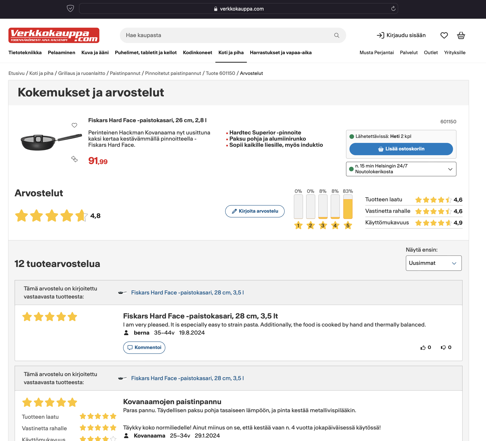
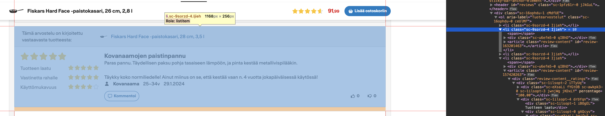
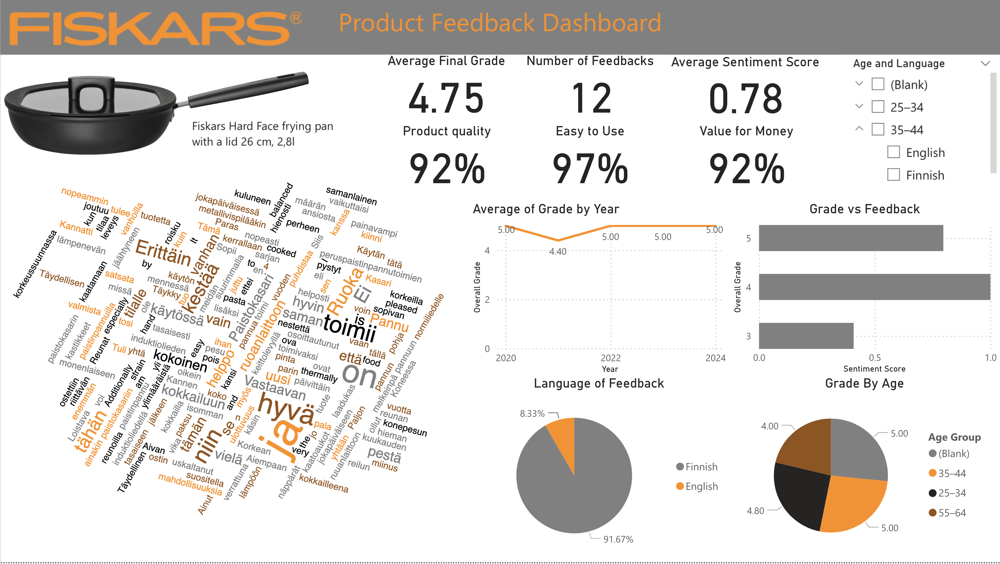

# Fiskars Reviews Web Scraping and Power BI Analysis

## Project Overview
This project demonstrates web scraping, data cleaning, and visualization skills using Python and Power BI. The goal is to extract customer feedback from [Verkkokauppa](https://www.verkkokauppa.com/fi/product/601150/Fiskars-Hard-Face-paistokasari-26-cm-2-8-l/reviews), clean and analyze the data, and create a detailed interactive report.

---

## Workflow and Features

### 1. Web Scraping
- Extracted reviews from the website using Python.
- Explored and utilized the website's HTML structure to retrieve relevant data.
- The code for web scraping is in the `main.py` file.

### 2. Data Preparation
- Created a raw dataset (`reviews.csv`) with intentionally "dirty" data to showcase Power BI data cleaning skills.
- Examples of issues in the dataset:
  - Combined "Customer Name and Age" field (e.g., `berna35–44v19.8.2024`).
  - Product quality values are not percentages.
  - Missing or invalid values.

### 3. Power BI Data Cleaning
- Used Power BI Desktop on a virtual machine to clean and transform the data.
- Key techniques applied in Power Query:
  - Splitting columns.
  - Changing data types.
  - Replacing values and errors.
  - Adding calculated columns.
  - Machine learning for sentiment scoring.
  - Creating custom columns for enhanced analysis.

### 4. Power BI Reporting
- Designed an interactive Power BI report using Fiskars' brand colors (gray, orange, black).
- Report features:
  - **Header**: Fiskars logo and product image.
  - **KPIs**: Key metrics displayed as cards.
  - **Trend Section**: Line chart for date vs. overall rating.
  - **Slicers**: Filters for age group and language.
  - **Word Cloud**: Visual representation of common feedback terms.
  - **Pie Chart**: Feedback counts by language.
- [View the interactive report]([https://app.powerbi.com/reportEmbed?reportId=f602685d-1d24-4c66-90d5-bc73da05d754&autoAuth=true&ctid=4d1a61d7-b6a5-4f64-8787-f074f87013ee](https://app.powerbi.com/links/fv7tJ4Wed_?ctid=4d1a61d7-b6a5-4f64-8787-f074f87013ee&pbi_source=linkShare))

---

## Screenshots
- **Original Website**  
  

- **HTML Exploration**  
  

- **Power Query Data Cleaning**  
  

- **Power BI Report**  
  

---

## Technologies Used
- **Python**: For web scraping and CSV file creation.
- **Power BI**: For data cleaning, analysis, and reporting.
- **Virtual Machine**: Power BI Desktop was used on a Windows VM.

---

## How to Use This Project
1. Clone the repository:
   ```bash
   git clone https://github.com/AngelinaLind/WebScraping_FiskarsReviews.git
